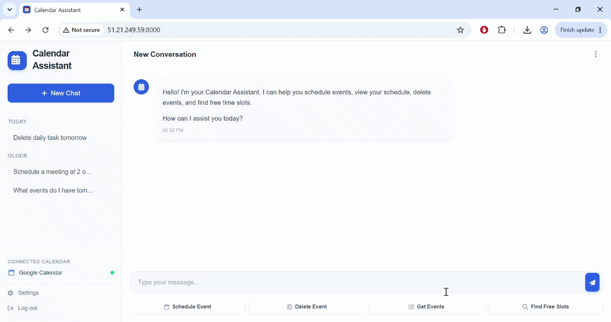

# Google Calendar AI Assistant

A conversational AI agent that manages your Google Calendar through natural language — schedule, delete, find free time, and query your schedule — built with **LangGraph + GPT-4o**, a **FastAPI** backend, and deployed via **Docker on AWS EC2**.

🔗 **Live demo:** [Try it here](http://51.21.249.59:8000)
*(hosted on a personal AWS instance)*

📽️ **Demo:** 
<p align="center">
        
</p>        

---

## What It Does

Talk to it like a person managing your calendar:
- *"Schedule a team meeting tomorrow at 3pm"*
- *"What's on my calendar today?"*
- *"Find me a free hour this Friday"*
- *"Delete the dentist appointment"*

The agent confirms before destructive actions, checks for scheduling conflicts before creating events, and remembers full conversation history across sessions — including surviving server restarts and redeployments.

---

## Architecture

```
Browser (HTML/CSS/JS, card-based UI)
        │  REST
        ▼
FastAPI (server.py) ── SQLite (chat sessions + LangGraph checkpoints)
        │
        ▼
LangGraph Agent (GPT-4o, tool-calling)
        │
        ▼
Tool Layer (create/delete/get_events/find_free_slots)
        │
        ▼
Service Layer (raw Google Calendar API calls)
        │
        ▼
Google Calendar (OAuth 2.0)
```

**Tech stack:** Python 3.11 · LangChain/LangGraph · OpenAI GPT-4o · FastAPI · SQLite · Vanilla JS/Tailwind · Docker · AWS EC2

---

## Engineering Decisions Worth Knowing About

**Two-layer architecture with real auth.** Raw Google Calendar API calls (authenticated via real OAuth 2.0, not an API key) live in a separate service layer from the LangChain tool wrappers, with a typed exception hierarchy (`AuthError`, `RateLimitError`, `EventNotFoundError`, etc.) mapping every API failure to something the agent can explain to the user.

**Cards built from tool output, not LLM text.** Structured UI cards (event created, event list, free slots) are built by intercepting `ToolMessage` objects directly — reliable, since tool output format is fixed by the code that wrote it, unlike free-form LLM text. Tradeoff: heuristic string matching instead of a second LLM classification call, avoiding extra latency/cost at this scale. Documented in code, not hidden.

**Diagnosed a real model-memory bug.** After adding persistent conversation history, GPT-4o started answering "what's on my calendar" from memory of earlier turns instead of calling `get_events` again — silently risking stale data if the calendar changed elsewhere. Fixed with an explicit system-prompt rule forcing a fresh tool call every time.

**SQLite persistence, correctly separated from Docker's lifecycle.** Conversation state and sidebar metadata are mounted as a Docker volume, not baked into the image — anything written inside a container's own filesystem is destroyed on redeploy. Verified with full stop/start cycles against real chat history.

**Three bugs that only surfaced once deployed.** Tailwind's CDN script needed swapping for a compiled, version-pinned stylesheet during the Docker build; my ISP blocking outbound SSH pushed me toward AWS Systems Manager (zero open inbound ports, IAM-based access — the AWS-recommended replacement for SSH); and the live frontend broke because `crypto.randomUUID()` is disabled by browsers outside HTTPS/localhost — fixed with a fallback UUID generator.

---

## Testing

- **26 mocked unit tests** — Google Calendar API error-handling paths (`calendar_service.py`), zero network calls or credentials required
- **27 unit tests** — card-matching logic (`cards.py`), covering every card type and suppression rule
- **Integration tests** — full tool stack against the real Google Calendar API

```bash
pytest tests/ -v
```

---

## Running It Locally

```bash
git clone https://github.com/Batouls1/Google-Calendar-Assistant.git
cd Google-Calendar-Assistant
pip install -r requirements.txt
# Add your own credentials.json, .env (OPENAI_API_KEY), and complete Google OAuth once
uvicorn server:app --reload
```

## Running It in Docker

```bash
docker build -t calendar-assistant .
docker run -d -p 8000:8000 \
  --env-file .env \
  -v $(pwd)/credentials.json:/app/credentials.json \
  -v $(pwd)/token.json:/app/token.json \
  -v $(pwd)/memory.db:/app/memory.db \
  --name calendar-assistant-container \
  calendar-assistant
```

---

## Known Limitations

- Card rendering relies on heuristic tool-output matching rather than structured LLM output — a deliberate cost/latency tradeoff, not an oversight
- No response streaming — replies arrive as a single completed message rather than token-by-token
- Settings/Log out sidebar buttons are visual placeholders, not implemented
- Single SQLite instance — fine at this scale, would need a networked database for real multi-user concurrency
- Mobile layout is functional but not fully polished — this is primarily a desktop productivity tool

---

## Author

Batoul · [GitHub](https://github.com/Batouls1)